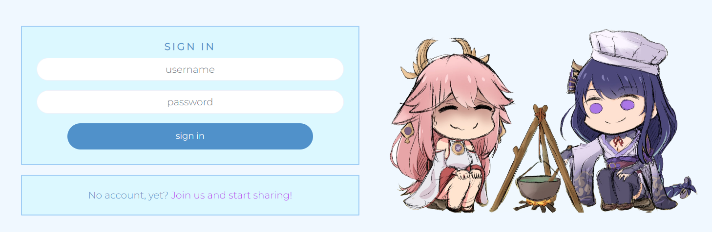

# Genshin Food Blog

[Deployed Site](https://genshin-recipes-blog.herokuapp.com/)

*In this ReadMe, I use Genshin Impact, and the abbreviated Genshin, interchangeably*

## **Introduction**

This Food Blog was created for my fifth project in Code Institute's Full Stack Software Development Course.
It is aimed at players of HoYoLab's Genshin Impact, providing a place to share recipes inspired by those we can craft in game. 

However, it is largely a Japanese/Chinese inspired food blog which is suitable for anybody who is looking for inspiration in these areas.

## UX

## **Strategy**

I wanted to make this blog because recreating your favourite dishes from various media is fun, but often difficult, as recipe instructions in games are generally limited to one or two generic ingredients, for example 'meat' and 'plant'. As such, I wanted a place which could compact recipes players have tried in real life in one place so others can enjoy the dishes they're familiar with in-game.

## **Scope**

## **User Stories**

The User Stories are mapped out in GitHub Projects using the Kanban board format. They are:

## Milestone One - Main
The first step was getting the general setup of the site's navbar across pages, display of the homepage and infinite scroll on the homepage up and running.

The user should be able to easily navigate the site, with no awkard refreshes or empty/broken screens while data is being fetched.

- As a user I can see the navbar on every page so that I can easily navigate the site
- As a user I can navigate pages without them refreshing so that I can smoothly navigate between content
- As a logged out user, I can view sign up/login options so that I can perform those actions and view more of the site's content
- As a user, I can view all recipes with the newest first so that I can stay up to date with new content as it is added
- As a user, I can endlessly scroll through content so that I can keep viewing without having to page refresh by navigating pages

## Milestone Two - Authentication
Second, I focussed on user authentication regarding account creation and access tokens, with content restrictions based on whether a user is logged in or not.

Users should be able to create accounts and remain logged in once they have done so for a reasonable period so they are not continuously forced to log back in whilst they are still browing the site.

- As a new user, I can create an account so I can access the features restricted to signed in users
- As a user, I can log in so that I can view/use the features restricted to signed in users
- As a user, I can see if I am logged in or not so that I can log in if required
- As a user, I can remain logged in so that my experience is not interrupted

## Milestone Three - Creating & Liking recipes
With user authentication working, I moved to recipe creation and liking as these are both available from the homepage.

A key experience for users of any blog site is interaction with the posts, so liking them in this case provides both a positive feedback interaction, and a way to revisit their favourite recipes.

- As a logged in user I can create new recipe posts so that I can share them with other users
- As a logged in user, I can like recipes/mark them as made so that I can give positive feedback and view them easily again later

## Milestone Four - Individual Recipe pages
This milestone focussed on leaving and displaying comments and providing functionality to edit/delete comments and edit/delete recipes if the user is the recipe's owner.

This allows users to further interact with creators, as well as see how others have enjoyed (or not) their recipes.

- As a user, I can navigate to individual recipes so that I can see details such as ingredients, method and comments left by other users
- As a user, I can see when a comment was left so that I can see how popular the recipe currently is
- As a logged in user, I can edit and delete my comments so that I can control my interaction with the recipe
- As a logged in user, I can edit/delete my recipes from their individual pages so that I can control my post after creation

## Milestone Five - Favourites & Made pages & Filters
This milestone was split in two:

First, displaying favourited and made recipes on their respective pages.

Second, adding a searchbar to the pages to allow users to search by creator or recipe name

- As a user I can view recipes I have liked so that I can easily come back to them
- As a user I can view recipes I have made so that I can easily come back to them

- As a logged in user, I can filter recipes to users I follow so I can see content from my favourite creators
- As a user, I can search recipes by specific keywords/users so that I can easily find what I am looking for
- As a user, I can view the most followed users so I can easily navigate to their profile -- this was changed to be the most liked recipes as it felt more relevant to the content of the website

## Milestone Six - Profiles
The final main milestone was user profiles, with editing functionality for the user's own profile, and relevant information displays when viewing others' profiles.

- As a user, I can view others' profiles so that I can see their posts, liked content and more
- As a user, I can view a user's recipes, likes & following/followed counts on their profiles so that I can easily browse their content and find new content
- As a user, I can follow/unfollow other users so that I can easily find my favourite creators and narrow results by them
- As a logged in user, I can edit my own profile so that I can update my public details
- As a user, I can edit my username & password so that I can keep them relevant and secure

Following the main milestones, focus was placed on tidying things the user doesn't necessarily see, but need to work.

## **Structure**

The website's structure allows almost everything to be accessible from everywhere.
From each page, bar the Create page, users can navigate to Create a Recipe and their Following, Favourites, Made & Profile pages. They can navigate to other users' profiles by clicking their names above their recipe posts.

## **Skeleton**

All pages follow the same general structure, bar the Create Recipe page.

Home, Following, Favourites, Made & Profile (for profile, recipes display is changed to profile content)

Create Recipe

## **Surface**

### **Colours**

Moving away from my previous themes of purples and blacks, I decided the brightness of Genshin Impact deserved a more light-themed site, this time. Therefore, the colour scheme revolves around blues and white-blues.

The background for all pages is aliceblue, a white tinted with blue which provides a slight contrast to generic white. Text, links and component backgrounds rotate between the following shades:

- #9fcdf5
- #5091ca
- #0d4e87

### **Features**

#### Navbar

The NavBar features on every page of the site, and provides the user with easy navigation to:

- The Home Page via the Site Logo

If the user is logged in:

- The Create Recipe page
- The Following page
- The Favourites page
- The Made page
- Sign Out button
- The Profile page

If the user is logged out:

- Sign In button
- Sign Up button

#### Home Page

Displays all recipes posted to the site in order of most recently created, with a reusable component displaying the most liked recipes, which features on all pages except the Create Recipe page and Sign In/Up/Out.

#### Create Recipe Page

Contains fields to add an image, recipe title, ingredients & method.

#### Following, Favourites & Made Pages

In order:

- Recipes by users the logged in user follows
- Recipes the logged in user has liked
- Recipes the logged in user has marked as made

#### Sign In Page

With link to the sign up page if the user does not already have an account.

#### Sign Up Page

With link to the sign in page if the user already has an account.

