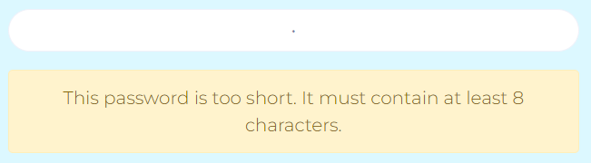
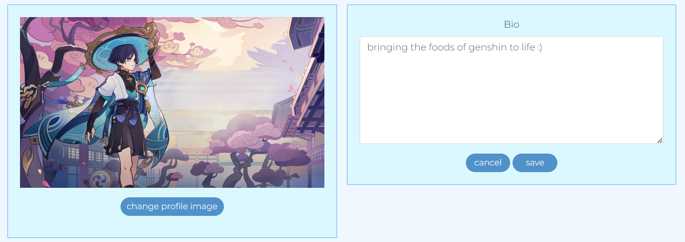
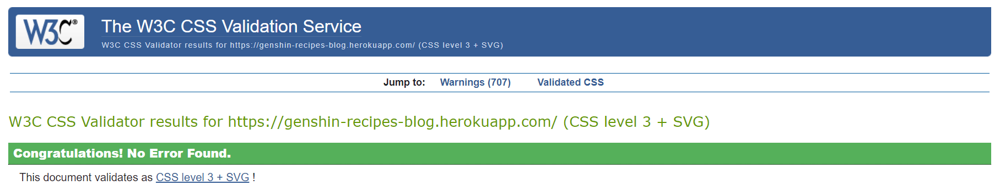

# Genshin Recipes Blog

[Deployed Site](https://genshin-recipes-blog.herokuapp.com/)

Repository for [API](https://github.com/charlie-vf/genshin-recipes-blog-api)

# Table of Contents

- [Introduction](#introduction)
- [UX](#ux)
    - [Strategy](#strategy)
    - [Scope & Sprints](#scope)
    - [Structure](#structure)
    - [Skeleton](#skeleton)
    - [Surface](#surface)
        - [Colours](#colours)
        - [Features](#features)
- [React](#react)
- [Future Features](#future-features)
- [Technologies](#technologies)
- [Testing](#testing)
- [Issues](#issues)
- [Deployment](#deployment)
- [Credits](#credits)

## **Introduction**

This Recipes Blog was created for my fifth project in Code Institute's Full Stack Software Development Course.
The objective of this site was to provide players of miHoYo's Genshin Impact with a place to share recipes inspired by those you can craft in-game within a community atmosphere.

Although aimed at the game's player base, it is largely a Japanese/Chinese inspired recipes blog which is suitable for anybody who is looking for inspiration in these areas.

This project uses a combination of HTML, CSS, JavaScript, React.js, Bootstrap.js & Django REST framework.

## **UX**

## **Strategy**

I wanted to make this blog because recreating your favourite dishes from various media is fun, but often difficult, as recipe instructions in games are generally limited to one or two generic ingredients, for example, 'meat' and 'plant'. As such, I wanted a place which could compact recipes players have tried in real life in one place so others can enjoy the dishes they're familiar with in-game.

The site has full CRUD functionality to allow creation, reading, updating & deletion.

## **Scope**

## User Stories

The User Stories and website features are mapped out in GitHub Projects for this repository using the Kanban board format. with priority labels and mapping to milestones, which were then split into the sprints detailed below. Almost all were successfully implemented, with those unfinished documented at the start of the Future Features section of this ReadMe. 

The user stories were split into six sprints across three weeks, with the fourth week being tidy-up:

## Sprint One - Main - Week One
The first step was planning & getting the general setup of the site's navbar across pages, display of the homepage and infinite scroll on the homepage up and running.

The user should be able to easily navigate the site, with no awkward refreshes, next/previous page navigation or empty/broken screens while data is being fetched.

- As a user, I can see the navbar on every page so that I can easily navigate the site
    - navbar displays seemlessly across all pages
- As a user, I can navigate pages without them refreshing so that I can smoothly navigate between content
- As a logged-out user, I can view sign-up/login options so that I can perform those actions and view more of the site's content
    - navbar conditional rendering displays these options when logged-out
- As a user, I can view all recipes with the newest first so that I can stay up to date with new content as it is added
    - content displays in descending order of most recent first
- As a user, I can endlessly scroll through content so that I can keep viewing without having to page refresh by navigating pages
    - infinite scroll implemented

## Sprint Two - Authentication - Week Two - One Day
Second, I focussed on user authentication regarding account creation and access tokens, with content restrictions based on whether a user is logged in.

Users should be able to create accounts and remain logged in once they have done so for a reasonable period so they are not continuously forced to log back in while they are still browsing the site.

- As a new user, I can create an account so I can access the features restricted to signed-in users
    - sign-up functionality allows users to create an account
- As a user, I can log in so that I can view/use the features restricted to signed-in users
    - sign-in functionality allows users to log-in to their account
- As a user, I can see if I am logged in or not so that I can log in if required
    - if logged-in, the navbar displays the user's profile and the 'sign out' option
    - if logged-out, the navbar displays 'sign in' and 'sign up'
- As a user, I can remain logged in so that my experience is not interrupted
    - JWT access tokens allow the user to remain logged in

## Sprint Three - Creating & Liking recipes - Week Two - Three Days
With user authentication working, I moved to recipe creation and liking, as these are both available from the homepage.

An essential experience for users of any blog site is interaction with the recipes, so the ability to like them provides both a positive feedback interaction and a way to revisit their favourite recipes.

- As a logged-in user I can create new recipe posts so that I can share them with other users
    - create recipe page allows users to create recipes and immediately publish them
- As a logged-in user, I can like recipes/mark them as made so that I can give positive feedback and view them easily again later
    - like/made functionality below each recipe allows users to like them from the main pages, and the individual recipe pages

## Sprint Four - Individual Recipe pages - Week Two - Three Days
This sprint focussed on leaving and displaying comments and providing functionality to edit/delete comments and edit/delete recipes if the user is the recipe's owner.

This allows users to further interact with creators and see how others have enjoyed (or not) their recipes.

- As a user, I can navigate to individual recipes so that I can see details such as ingredients, method and comments left by other users
    - users can click the username, recipe image or comments icon to navigate to the recipe's individual page
- As a user, I can see when a comment was left so that I can see how popular the recipe currently is
    - comment date is displayed next to the username for a comment
- As a logged-in user, I can edit/delete my comments so that I can control my interaction with the recipe
    - burger icon allows users to edit/delete
- As a logged-in user, I can edit/delete my recipes from their individual pages so that I can control my post after creation
    - burger icon allows users to edit/delete

## Sprint Five - Favourites & Made pages, Search & Popular Component - Week Three - Three Days
This sprint was split in two:

First, displaying favourited and made recipes on their respective pages and creating the popular recipes component

Second, adding a search bar to the pages to allow users to search by creator or recipe name

- As a logged-in user, I can view recipes I have liked so that I can easily come back to them
    - favourites page filters the site's recipes by those the user has liked
- As a logged-in user, I can view recipes I have made so that I can easily come back to them
    - made page filters the site's recipes by those the user has marked as made
- As a logged-in user, I can filter recipes by users I follow so I can see content from my favourite creators
    - following page filters the site's recipes by those from users the user follows

- As a user, I can search recipes by specific keywords/users so that I can easily find what I am looking for
    - searchbar implemented with a timer to prevent fetch requests being sent after each keystroke
    - the searchbar allows users to search by username and content keywords

- As a user, I can view the most followed users so I can easily navigate to their profile -- this was changed to be the most liked recipes as it felt more relevant to the content of the website as liking recipes would likely be more frequent than following users
    - popular recipes component provides access to the community's favourite recipes & displays the number of likes

## Sprint Six - Profiles - Week Three - Three Days
The final main sprint was user profiles, including editing functionality for the user's profile and ensuring relevant information displays when viewing others' profiles.

- As a user, I can view others' profiles so that I can see their posts, liked content and more
    - a user can navigate to other users' profiles and see recipes
- As a user, I can view a user's  likes & following/followed counts on their profiles so that I can easily browse their content and find new content
    - users can view another user's following & followed counts
    - other functionality not fully implemented - see Future Features
- As a user, I can follow/unfollow other users so that I can easily find my favourite creators and narrow results by them
    - follow/unfollow button available on user profiles
    - auto-updates user stats
    - users can navigate to the Following page to narrow results by creators they are following
- As a logged-in user, I can edit my profile so that I can update my public details
    - burger icon on user's profile allows editing of bio
- As a user, I can edit my username & password so that I can keep them relevant and secure
    - burger icon on user's profile allows editing of username & password

Following the main sprints, Week Four focused on tidying up, final testing and removing unnecessary/unused code.

## **Structure**

The website's structure allows almost everything to be accessible from everywhere.
From each page, logged-in users can navigate to Create a Recipe and their Following, Favourites, Made & Profile pages. Logged-in users can sign out from anywhere.

Users can navigate to other users' profiles by clicking their names above their recipe posts. 

For logged-out users, they can navigate to the Sign Up/Sign In pages, user recipes and profiles.

The following diagram details how the site's main pages all link together for logged-in users, bar the Sign Out button, which remains in the NavBar throughout, as this is not a page.

## **Skeleton**

All main pages follow the same general layout. The layout is simple so all content is easily viewable for all users.

Home, Following, Favourites, Made & Profile (for profile, recipes display is changed to profile content)

Create Recipe

## **Surface**

### **Font Family**

The font used throughout this site is Montserrat from Google Fonts. I chose this because it is a clear, softer font which fits with the overall gentle theme of the site.
The backup font is sans-serif.

### **Colours**

Moving away from my previous themes of purples and blacks, I decided the brightness of Genshin Impact deserved a more light-themed site this time. Therefore, the colour scheme revolves around blues and white-blues.

The background for all pages is aliceblue, a white tinted with blue which provides a slight contrast to generic white. Text, links and component backgrounds rotate between the following shades:

- #f0f8ff
- #9fcdf5
- #5091ca
- #0d4e87

### **Features**

*Navbar*

The NavBar features on every page of the site and provides the user with easy navigation to:

- The Home Page via the Site Logo

If the user is logged-in:

- The Create Recipe page
- The Following page
- The Favourites page
- The Made page
- Sign Out button
- The Profile page

If the user is logged out:

- Sign In button
- Sign Up button

*Home Page*

Displays all recipes posted to the site in order of most recently created, with a reusable component displaying the most liked recipes, which features on all pages except the Create Recipe page and Sign In/Up.

*Following, Favourites & Made Pages*

Same layout as home page, filtered to display relevant content.

In order:

- Recipes by users the logged-in user follows
- Recipes the logged-in user has liked
- Recipes the logged-in user has marked as made

*Create Recipe Page*

Contains fields to add an image, recipe title, ingredients & method.

*Profile Page*

Displays the popular recipes component, with the main component changing to display user avatar, stats & their own recipes.

Own Profile Page:

Other User's Profile Page:

*Sign In Page*

With a link to the sign-up page if the user does not already have an account.

Error message displayed if incorrect credentials entered.

*Sign Up Page*

With a link to the sign-in page if the user already has an account.

Error messages

Error messages are displayed if user input is invalid, for example:

Attempting to submit with empty fields:

Attempting to submit with insufficient password length:

*Edit Profile Options*

Available on the user's profile when logged-in via a burger icon. Users can edit their profile image and bio, change their username and update their password.

Edit Profile Page - prefilled with current bio (if applicable) and profile image

Change Username Page - prefilled with current username

Change Password Page

*No Results*

Displays if there are no results, e.g., if a user navigates to 'Following' but is yet to follow a user, or types an invalid name/word into the searchbar.

React routing allows the text under the image to be relevant to the page the user is viewing.

## **React**

React is an optimal library for improving user experience as it allows for real-time updating of website content across a range of components, without the need for page refresh.

In the case of this website:

- When a user follows a profile, this is immediately apparent in their user stats and the follow/unfollow button changes accordingly
- When a user likes or marks a recipe as made, the relevant icon immediately changes and the count increases to reflect the user's actions
    - The same is true for unliking/unmarking as made
- When a user comments on a recipe, the comment appears instantly below the recipe
    - When a user edits/deletes a comment, this is immediately reflected under the recipe
- When a user creates a new recipe, they will automatically be redirected to the homepage with their new recipe displaying
- When a user edits their bio, this change is automatic
- All creation and update times display real-time data

While data is loading, the user will see a spinner (displayed using an Asset) to notify them that content is on its way to their screen.

The Popular Recipes component remains mounted while navigating through pages which branch from AllRecipes.js and thus always displays, even while other content is loading.

## *Components*

To minimise unnecessary repetition in this application and overly large/complicated JavaScript files, small-function and/or multi-use components were created in separate files to allow them to be easily implemented and customised throughout the site. This also aided in troubleshooting as smaller aspects of each of the site's functions could be worked on without affecting the site as a whole.

Examples: 

The most obvious of these is the NavBar, which also uses the reusable CurrentUser context to display appropriate links & content based on whether the user is logged in.

As there are three areas which utilise edit and/or delete functionality (user's profile, user's recipes & user's comments), I created the EditDeleteDropdown component to hold the main code for these alterations, and imported it into the relevant files with further work, such as handle functions, being present in those individual files. This prevented having to rewrite the parts of the dropdown menu which would be the same throughout every component I wanted this feature to be.

The Avatar component is used both for displaying the User's profile photo on various components (i.e., recipes, comments, profile page) and for the icon in the Popular Recipes component. As such, I created a generic component for the Avatar which could be customised to display the relevant image.

## **Future Features**

These three were not implemented in this release due to time constraints created by my laptop breaking, and thus losing multiple days sourcing a new one to continue work.

- Ability to leave a rating and review on recipes after marking them as made. This will be viewable on the recipe's page as an additional component.
- Filter favourites page by recipes the user has tried, instead of those being displayed as a separate page.
- User stats (followers & following) when clicked navigate to the relevant content

I believe these features would improve the user experience of this site:

- the first for viewers of others' recipes and the owners of the recipes themselves as it would provide invaluable feedback on the reception of content amongst site users
- the second as it would be less clunky than having two different pages for the content
- the third as it would allow greater reach for users and their recipes

Further Features:

- Messaging functionality to allow users to message others
    - message recipe creators to ask questions or suggest recipes they should attempt to recreate
    - message other users so as to create a more personal feel to the site over just what commenting under recipes can provide

- Install a Text Editor to improve the ingredients and methods content displays. As with the first three future features, this had to be benched due to sudden technical constraints.

- Way to view who has liked a recipe/marked it as made, potentially as a pop-up/overlay.

- Delete confirmation modal to prevent accidental deletion of recipes/comments

- Option to delete profile

## **Technologies**

Languages:

- HTML5
- CSS
- JavaScript

Frameworks etc.:

- Django/allauth
- Bootstrap - further CSS package for design as this works optimally with React & JSX
- Cloudinary - image hosting as Django does not store images long-term by default
- ElephantSQL - database hosting
- GitHub - website hosting
- Git - version control
- GitPod - development platform
- Heroku - deployed website host

## **Testing**

### **Validation**

CSS Validator: all CSS passed through W3C CSS validator with no issues

HTML Validator: flagged trailing slashes and, once removed, passed through W3C NU validator with no issues.

JavaScript Validator: after fixing missing semicolons and misleading line breaks in conditionals, all JavaScript code passed with no warnings.

Lighthouse Report: 

- Performance: how fast the page loads
    - Needs work
    - Mostly raised issues with image load times & JavaScript in default files

- Accessibility: how easily users can read the screen - colour contrast
    - Good
    - Improved by darkening the font colour of button elements & adding an alt tag to the profile image

- Best Practices: secure connections & JavaScript vulnerabilities
    - Good

- SEO (Search Engine Optimisation): searchability
    - Good

### **Browser & Mobile Compatability**

The site was tested on Google Chrome, Microsoft Edge & Safari and functioned normally.

The site was tested on iPhone and functioned normally.

### **Manual**

All site functionality was repeatedly and rigorously tested throughout production to spot any issues as they arose.

1. NavBar/Main Pages

- All NavBar links tested to ensure they navigated to the correct pages, which initially displayed placeholder text
- If pages have no associated content, they display the noresults asset

2. Authentication restrictions

- Attempted to force-perform actions the user was not in the correct state to perform
    - navigating to /recipes/create while logged out successfully redirected the user back to the previous page
    - navigating to the edit page, e.g., /recipes/edit/19 while not logged into Felix's account (that recipe id's owner) successfully redirected the user back to the previous page

3. Profiles

- Initially tested by following the Sign Up link to create an account, then creating a recipe via the Create Recipe link.
- After implementation of the Profile and ProfilePage components, further testing as development progressed included:

    - navigating to the profile manually through the URL (e.g., /profiles/1)
    - navigating to the profile via the 'Profile' link
    - navigating to the profile via the user's posted recipes
    - creating further users to test following/unfollowing functionality
    - ensuring user's recipes displayed when viewing their profile
    - ensuring user's stats displayed and updated immediately when viewing their profile
    - following the links available in the profile dropdown (edit username, edit profile (image & bio), change password) and performing those actions

4. Recipes

- Initially tested while testing Profiles by creating a recipe and ensuring it displayed on the Home page (AllRecipes)
- Editing a recipe was tested by editing the image, title, ingredients & method individually and all at once and was successful
    - and redirects to the previous page once complete
- Deleting a recipe via the delete option was successful
    - and redirects to the previous page once complete
- Like/Made/Commenting functionality tested upon completion on multiple recipes
    - On a recipe the user created, I attempted to like and was presented with the appropriate error message
    - On a recipe the user did not create, I attempted to like and was successful in changing the icon and increasing the like display count by 1
    - Clicking the 'Made' foodbowl icon changed the icon and increased the count by 1
    - Secondary clicks of like and made once the count has increased successfully changed the icon and decreased the count by 1
    - Commenting successfully displayed the comment immediately without page refresh
    - On the user's own comments, navigating to edit and delete via the burger icon successfully completed those actions without page refresh

5. Mobile View

- Tested on laptop by shrinking screen to see how the pages changed and using DevTools to view on various screen sizes, as well as on my mobile device.
    - Helped flag issues whereby certain components failed to display on mobile view. These were all fixed.

## **Issues**

### Resolved

- Issue whereby a logged-in user could not log out and had to wait for the access token to expire
    - This was due to missing 'response' in logout_view return in the back-end
- Issue whereby anybody could access the Create Recipes page, regardless of authentication state
    - This was due to a permissions issue in the back-end and was found & fixed through manual testing
- Access to the site being blocked by CORS
    - This was due to using the incorrect BaseURL in axiosDefaults

### Unresolved

- Uncertain how to resolve: occasionally, access is blocked to 'dj-rest-auth/user/' with a 401 error
    - This error can be cleared by refreshing the page

## **Deployment**

This project was created using a GitPod workspace, committed to Git, pushed to GitHub and deployed on Heroku.

To clone this repo:

- Beneath the repository name, click 'Code' and copy the clone HTTPS
- Open your preferred IDE & navigate into the working directory you wish to clone into
- Type 'git clone', paste the copied HTTPS & press enter

Heroku Deployment Steps:

- Select New App & choose a name and location
- Select Deploy and link to GitHub repository
- Manually deploy site (choose automatic deployment if desired)

- Select Settings -> Reveal Config Vars
- Add CLIENT_ORIGIN: your deployed site URL

## **Credits**

- All images were taken from Google Images
- All recipes were taken from Google, YouTube, Reddit & HoyoLab (Genshin Impact's creator's official social media page)
- [Google Fonts](https://fonts.google.com/) for Montserrat font
- [FontAwesome](https://fontawesome.com/) for icons
- [LucidChart](https://lucid.app/) for Wireframes sketches

- Code Institute Walkthrough project for helping understand how everything works
- Slack for troubleshooting help
- Stack Overflow for further troubleshooting help