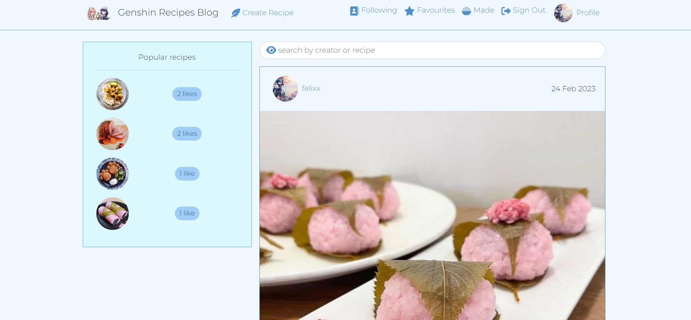
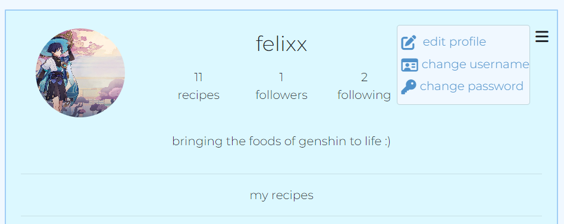

# Genshin Food Blog

[Deployed Site](https://genshin-recipes-blog.herokuapp.com/)

*In this ReadMe, I use Genshin Impact, and the abbreviated Genshin, interchangeably*

## **Introduction**

This Food Blog was created for my fifth project in Code Institute's Full Stack Software Development Course.
It is aimed at players of HoYoLab's Genshin Impact, providing a place to share recipes inspired by those we can craft in game. 

However, it is largely a Japanese/Chinese inspired food blog which is suitable for anybody who is looking for inspiration in these areas.

## UX

## **Strategy**

I wanted to make this blog because recreating your favourite dishes from various media is fun, but often difficult, as recipe instructions in games are generally limited to one or two generic ingredients, for example 'meat' and 'plant'. As such, I wanted a place which could compact recipes players have tried in real life in one place so others can enjoy the dishes they're familiar with in-game.

## **Scope**

## **User Stories**

The User Stories are mapped out in GitHub Projects using the Kanban board format. All were successfully implemented, explanation for which can be found in the Future Features section of this ReadMe. 

The user stories are:

## Milestone One - Main - Week One
The first step was getting the general setup of the site's navbar across pages, display of the homepage and infinite scroll on the homepage up and running.

The user should be able to easily navigate the site, with no awkard refreshes or empty/broken screens while data is being fetched.

- As a user I can see the navbar on every page so that I can easily navigate the site
- As a user I can navigate pages without them refreshing so that I can smoothly navigate between content
- As a logged out user, I can view sign up/login options so that I can perform those actions and view more of the site's content
- As a user, I can view all recipes with the newest first so that I can stay up to date with new content as it is added
- As a user, I can endlessly scroll through content so that I can keep viewing without having to page refresh by navigating pages

## Milestone Two - Authentication - Week Two
Second, I focussed on user authentication regarding account creation and access tokens, with content restrictions based on whether a user is logged in or not.

Users should be able to create accounts and remain logged in once they have done so for a reasonable period so they are not continuously forced to log back in whilst they are still browing the site.

- As a new user, I can create an account so I can access the features restricted to signed in users
- As a user, I can log in so that I can view/use the features restricted to signed in users
- As a user, I can see if I am logged in or not so that I can log in if required
- As a user, I can remain logged in so that my experience is not interrupted

## Milestone Three - Creating & Liking recipes - Week Two
With user authentication working, I moved to recipe creation and liking as these are both available from the homepage.

A key experience for users of any blog site is interaction with the posts, so liking them in this case provides both a positive feedback interaction, and a way to revisit their favourite recipes.

- As a logged in user I can create new recipe posts so that I can share them with other users
- As a logged in user, I can like recipes/mark them as made so that I can give positive feedback and view them easily again later

## Milestone Four - Individual Recipe pages - Week Two
This milestone focussed on leaving and displaying comments and providing functionality to edit/delete comments and edit/delete recipes if the user is the recipe's owner.

This allows users to further interact with creators, as well as see how others have enjoyed (or not) their recipes.

- As a user, I can navigate to individual recipes so that I can see details such as ingredients, method and comments left by other users
- As a user, I can see when a comment was left so that I can see how popular the recipe currently is
- As a logged in user, I can edit and delete my comments so that I can control my interaction with the recipe
- As a logged in user, I can edit/delete my recipes from their individual pages so that I can control my post after creation

## Milestone Five - Favourites & Made pages & Filters - Week Three
This milestone was split in two:

First, displaying favourited and made recipes on their respective pages.

Second, adding a searchbar to the pages to allow users to search by creator or recipe name

- As a user I can view recipes I have liked so that I can easily come back to them
- As a user I can view recipes I have made so that I can easily come back to them

- As a logged in user, I can filter recipes to users I follow so I can see content from my favourite creators
- As a user, I can search recipes by specific keywords/users so that I can easily find what I am looking for
- As a user, I can view the most followed users so I can easily navigate to their profile -- this was changed to be the most liked recipes as it felt more relevant to the content of the website

## Milestone Six - Profiles - Week Three
The final main milestone was user profiles, with editing functionality for the user's own profile, and relevant information displays when viewing others' profiles.

- As a user, I can view others' profiles so that I can see their posts, liked content and more
- As a user, I can view a user's recipes, likes & following/followed counts on their profiles so that I can easily browse their content and find new content
- As a user, I can follow/unfollow other users so that I can easily find my favourite creators and narrow results by them
- As a logged in user, I can edit my own profile so that I can update my public details
- As a user, I can edit my username & password so that I can keep them relevant and secure

Following the main milestones, Week Four focus was placed on tidying up things the user doesn't necessarily see, further testing and removing unecessary/unused code.

## **Structure**

The website's structure allows almost everything to be accessible from everywhere.
From each page, bar the Create page, logged in users can navigate to Create a Recipe and their Following, Favourites, Made & Profile pages. They can navigate to other users' profiles by clicking their names above their recipe posts. 

For logged out users, they can navigate to the Sign Up/Sign In pages, user recipes and profiles.

The following image displays how the main site's pages all link together for logged in users, bar the Sign Out button which remains in the NavBar throughout, as this is not a page.

## **Skeleton**

All main pages follow the same general layout, bar the Create Recipe page. The layout is simple so all content is easily viewable for all users.

Home, Following, Favourites, Made & Profile (for profile, recipes display is changed to profile content)

Create Recipe

## **Surface**

### **Colours**

Moving away from my previous themes of purples and blacks, I decided the brightness of Genshin Impact deserved a more light-themed site, this time. Therefore, the colour scheme revolves around blues and white-blues.

The background for all pages is aliceblue, a white tinted with blue which provides a slight contrast to generic white. Text, links and component backgrounds rotate between the following shades:

- #f0f8ff
- #9fcdf5
- #5091ca
- #0d4e87

### **Features**

#### Navbar

The NavBar features on every page of the site, and provides the user with easy navigation to:

- The Home Page via the Site Logo

If the user is logged in:

- The Create Recipe page
- The Following page
- The Favourites page
- The Made page
- Sign Out button
- The Profile page

If the user is logged out:

- Sign In button
- Sign Up button

#### Home Page

Displays all recipes posted to the site in order of most recently created, with a reusable component displaying the most liked recipes, which features on all pages except the Create Recipe page and Sign In/Up.

#### Following, Favourites & Made Pages

In order:

- Recipes by users the logged in user follows
- Recipes the logged in user has liked
- Recipes the logged in user has marked as made

#### Create Recipe Page

Contains fields to add an image, recipe title, ingredients & method.

#### Sign In Page

With link to the sign up page if the user does not already have an account.

#### Sign Up Page

With link to the sign in page if the user already has an account.

#### Edit Profile Options

Available on the user's own profile when they are logged in via a burger icon. Users can edit their profile image and bio, change their username and update their password.

Edit Profile Page

Change Username Page - prefilled with current username

Change Password Page

## **React Components**

To minimise unnecessary repetition in this application, cross-page components were created in separate files to allow them to be easily implemented and customised throughout the site. This also aided in troubleshooting as smaller aspects of each of the site's functions could be worked on without affecting the site as a whole.

Examples: 

The most obvious of these is the NavBar, which uses the reusable CurrentUser context to display appropriate links & content based on whether the user is logged in or not.

As there are three areas which utilise edit and/or delete functionality (user's profile, user's recipes & user's comments), I created the EditDeleteDropdown component to hold the main code for these alterations, and imported it into the relevant files with further work, such as handle functions, being present in those individual files. This prevented having to rewrite the parts of the dropdown menu which would be the same throughout in every component I wanted this feature to be.

The Avatar component is used both for displaying the User's profile photo on various components (i.e. recipes, comments, profile page) and for the icon in the Popular Recipes component. As such, I created a generic component for the Avatar which could be customised to display the relevant image.

## **Future Features**

- Ability to leave a rating and review on recipes after marking them as made. This will be viewable on the recipe's page as an additional component.
- Filter favourites page by recipes user has tried, instead of those being displayed as a separate page.

The above were not implemented in this release due to time constraints created by my laptop breaking, and thus losing multiple days sourcing a new one to continue work.

I believe both of these features would really improve the user experience of this site, both for viewers of others' recipes and the owners of the recipes themselves as it would provide invaluable feedback on the reception of content amongst users of the site.

- Messaging functionality to allow users to message others
    - message recipe creators to ask questions or suggest recipes they should attempt to recreate
    - message other users so as to create a more personal feel to site to just what commenting under recipes can create

- Install a Text Editor to improve the display of ingredients and methods content. As with the first two future features, this had to be benched due to sudden technical constraints.

- Way to view who has liked a recipe/marked it as made, potentially as a pop-up.

## **Technologies**

Languages:

- HTML5
- CSS
- JavaScript

Frameworks etc.:

- Django/allauth
- Bootstrap - CSS package for design
- Cloudinary - image hosting
- ElephantSQL - database hosting
- GitHub - website hosting
- GitPod - development platform
- Heroku - deployed website host

## **Testing**

### Manual

All functionality of the site was repeatedly and rigorously tested throughout production to spot any issues as they arised.

1. NavBar

- All NavBar links tested repeatedly to ensure they navigated to the correct pages, which intially displayed placeholder text

2. Authentication restrictions

- Attempted to force-perform actions the user was not in the correct state to perform
    - navigating to /recipes/create while logged out successfully redirected the user back to the previous page
    - navigating to the edit page, e.g. /recipes/edit/19 whilst not logged into Felix's account (that recipe id's owner) successfully redirected the user back to the previous page

3. Profiles

- Initially tested by following the Sign Up link to create an account, then creating a recipe via the Create Recipe link.
- After implementation of the Profile and ProfilePage components, further testing as development progressed included:

    - navigating to the profile manually through the URL (e.g. /profiles/1)
    - navigating to the profile via the user's posted recipes
    - creating further users to test following/unfollowing functionality
    - ensuring user's recipes displayed when viewing their profile
    - ensuring user's stats displayed and updated immediately when viewing their profile
    - following the links available in the profile dropdown (edit username, edit profile (image & bio), change password) and performing those actions

4. Recipes

- Initially tested whilst testing Profiles by creating a recipe and ensuring it displayed on the Home page (AllRecipes)
- Editing a recipe was tested by editing the image, title, ingredients & method individually and all at once and was successful
    - and redirects to the previous page once complete
- Deleting a recipe via the delete option was successful
    - and redirects to the previous page once complete
- Like/Made/Commenting functionality tested upon completion on multiple recipes
    - On a recipe the user created, I attempted to like and was presented with the appropriate error message
    - On a recipe the user did not create, I attempted to like and was successful in increasing the like display count by 1
    - Clicking the 'Made' foodbowl icon increased the count by 1
    - Secondary clicks of like and made once count has increased successfully decreased the count by 1
    - Commenting successfully displayed the comment immediately without page refresh
    - On the user's own comments, navigating to edit and delete via the burger icon successfully completed those actions

5. Mobile View

- Tested on laptop by shrinking screen to see how the pages changed and using DevTools to view on various screen sizes, as well as on my mobile device.
    - Helped flag issues whereby certain components failed to display on mobile view. These were all fixed.

## **Issues**

### Resolved

- Issue whereby a logged in user could not log out and had to wait for the access token to expire
    - This was due to missing 'response' in logout_view return
- Issue whereby anybody could access the Create Recipes page, regardless of authentication state
    - This was due to a permissions issue in the back-end and was found & fixed through manual testing
- Access to site being blocked by CORS
    - This was due to using the incorrect BaseURL in axiosDefaults

### Ongoing

- Uncertain how to resolve: occasionally, access is blocked to 'dj-rest-auth/user/'
    - This error can be cleared by refreshing the page

## **Credits**

- All images were taken from Google
- All recipes were taken from Google, YouTube, Reddit & HoyoLab (Genshin Impact's creator's official social media page)
- Slack for troubleshooting help
- Stack Overflow for further troubleshooting help